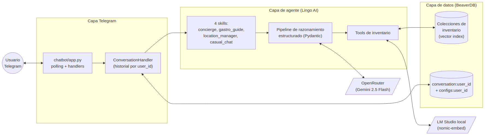
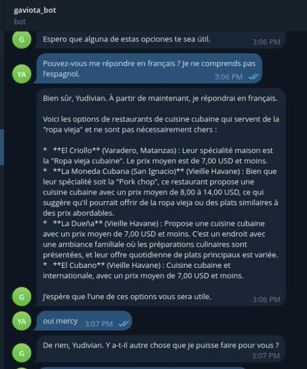
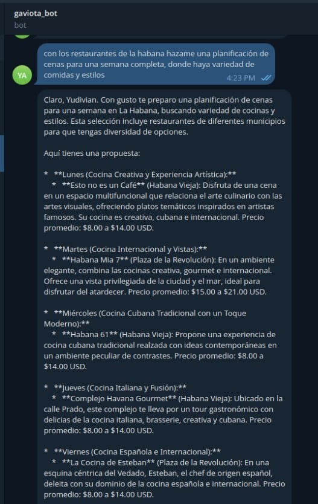

## 1. Resumen

El **Chatbot Gaviota MVP** es un asistente conversacional Telegram (`gaviota_bot`) construido como **prueba de concepto durante un curso impartido en Gaviota SA, conjunto entre la Universidad de Alicante (GPLSI) y la Universidad de La Habana (GIA-UH)**, con apoyo de SYALIA SRL. **El sistema no tiene propósitos comerciales — sólo demostrativos**, y sirve como artefacto pedagógico para ilustrar la integración de modelos de lenguaje, búsqueda vectorial, agentes con herramientas y razonamiento estructurado en un dominio aplicado: el turismo gastronómico y hotelero en Cuba. El bot es multilingüe por demanda —responde en el idioma original del usuario— y opera sobre un inventario de hoteles, restaurantes y lugares indexado localmente como datos JSON.

## 2. Arquitectura del sistema

El sistema se organiza en cuatro capas. La **capa Telegram** (`chatbot/app.py`) se construye sobre `python-telegram-bot` y mantiene un *polling loop* con dos *handlers* (`/start` y mensaje libre); un envoltorio `ConversationHandler` persiste el historial conversacional de cada usuario. La **capa de agente** (`chatbot/bot.py`) está construida sobre **Lingo AI**: materializa el agente, registra las skills decoradas con `@chatbot.skill`, e implementa el pipeline de razonamiento estructurado (sección 5) y el conjunto de *tools* de inventario. La **capa de datos** se apoya en **BeaverDB** sobre SQLite local; almacena las colecciones de inventario indexado vectorialmente, así como las colecciones por usuario `conversation:{user_id}` y `configs:{user_id}`. Finalmente, la **capa de modelos** es dual: un **LLM conversacional** servido por OpenRouter (Gemini 2.5 Flash por defecto, intercambiable) y un **modelo de embeddings** servido localmente vía LM Studio (`text-embedding-nomic-embed-text-v1.5` por defecto). La separación entre proveedor LLM y proveedor de embeddings es deliberada: cada uno se reemplaza independientemente sin tocar la lógica del agente.

{#fig-arquitectura width=70%}

## 3. Modelo de datos e indexación

El inventario consultable —hoteles, restaurantes, lugares— vive como **archivos JSON** bajo `data/jsons/`, uno por colección; el nombre del archivo determina el nombre de la colección BeaverDB resultante. El script `chatbot/index.py` recorre cada archivo, y para cada registro (con campos esperados `name` y `description`) construye un texto `f"{name}. {description}"`, lo embebe con el modelo configurado, y almacena un `Document` con dos partes: el **vector embedding** y el **body completo del item** preservado tal cual.

Esa separación es deliberada e importante. El embedding sirve exclusivamente para *recuperación semántica* (búsqueda por descripción libre, similitud de propósito); pero los atributos detallados —precio, dirección, teléfono, tipo de cocina, barrio, capacidad— viven en el body sin pérdida y se consultan en una fase posterior de *enrichment* sobre los candidatos ya recuperados. Esta arquitectura permite respuestas que combinan recuperación difusa con datos estrictos. La memoria conversacional usa una colección separada `conversation:{user_id}` (lista de mensajes Pydantic) con configuración por usuario en `configs:{user_id}`; la ventana de contexto efectiva es configurable (5 mensajes por defecto).

## 4. Skills y enrutamiento

El agente expone **cuatro skills** decoradas con `@chatbot.skill`, que Lingo enruta a partir del mensaje del usuario y del contexto conversacional acumulado:

- **`concierge`** — consultas generales de turismo: qué hacer, planes mixtos, recomendaciones cruzadas que combinan hoteles, restaurantes y lugares.
- **`gastro_guide`** — específica de gastronomía: búsqueda y filtrado de restaurantes, planificación de menús multi-día, comparación por cocina, precio o barrio.
- **`location_manager`** — geo-conciencia: dónde está el usuario, búsqueda por proximidad, resolución semántica de menciones libres a municipios cubanos contra `CUBAN_GEOGRAPHY` (mapeo provincia → municipios *hardcoded* en `chatbot/utils.py`), y verificación de *freshness* de la ubicación declarada.
- **`casual_chat`** — *fallback* conversacional para turnos no clasificables como solicitud de inventario.

Cada skill ejecuta el pipeline de razonamiento descrito en la sección 5, invocando el subconjunto de *tools* relevantes. Por ejemplo, `gastro_guide` emplea `search_restaurants_by_description`, `filter_restaurants` y `get_restaurant_details`; `location_manager` usa `find_places_location` y `set_user_location`. Las *tools* son funciones asíncronas tipadas que el agente puede invocar como parte de su plan de ejecución.

## 5. Pipeline de razonamiento estructurado

Dentro de cada skill, el procesamiento de un turno es **multi-etapa con salidas tipadas vía Pydantic** —no una sola llamada al LLM— y se organiza en cinco pasos:

1. **Extracción de intent.** `get_user_intent` invoca al LLM para producir un `UserIntent` tipado: tipo de petición, *scope* del contexto (`ContextScope`: nuevo, refinamiento, paginación) y entidades mencionadas. En paralelo, `get_search_limit` extrae cuántos resultados pidió explícitamente el usuario.
2. **Intent espacial.** Cuando aplica, `get_spatial_intent` produce un `SpatialIntent` con el tipo de relación geográfica (en, cerca de, entre) y el tipo de ancla (municipio, hito, ubicación previa del usuario). `resolve_municipality_semantic` traduce menciones libres al `CUBAN_GEOGRAPHY` *hardcoded*.
3. **Diseño del plan.** `design_data_processing_plan` genera un `StrategicPlan` que contiene una lista de `ResourceAction`s (qué colecciones consultar, con qué filtros) y un `ProcessingRecipe` con `ProcessStep`s (cómo combinar, ordenar y limitar los resultados antes de pasarlos al LLM final).
4. **Ejecución de *tools*.** Las acciones del plan disparan búsqueda vectorial (`_vector_search` sobre la colección correspondiente), filtros estructurados sobre el body completo —apoyados en primitivas de *fuzzy match* (`is_fuzzy_match`, `check_any_match`, `check_text_match`, `count_matches`)— y *enrichment* por nombre exacto cuando el usuario menciona una entidad concreta.
5. **Síntesis final.** El LLM compone la respuesta final al usuario con un *system prompt* aumentado por el `ANTI_HALLUCINATION_GUARD`. Esa guarda establece una jerarquía explícita: los resultados filtrados por las *tools* (`TOOLS_EXECUTION_LOG`) son la lista canónica; el inventario completo (`INVENTORY_DATA`) es expansión permitida sólo cuando el log está vacío o es insuficiente; queda **explícitamente prohibido mezclar atributos entre entidades** ("no bleeding"); y los datos faltantes deben **omitirse en silencio**, no rellenarse con etiquetas tipo "no disponible".

El estado de búsqueda (consulta, límite, candidatos) se persiste vía `save_search_snapshot`, lo cual habilita paginación y refinamiento natural a lo largo de turnos sucesivos: "muéstrame más", "filtra los anteriores por barrio Vedado", "el segundo de la lista, dame su dirección".

## 6. Capacidades demostradas

El bot real (`@gaviota_bot` en Telegram, durante las sesiones del curso) muestra tres rasgos relevantes en interacción con usuarios:

- **Multilingüe por demanda.** Cuando el usuario cambia al francés a media conversación, el bot detecta el cambio y continúa la interacción en francés sin perder el contexto previo, traduciendo descripciones, barrios y rangos de precio.
- **Conocimiento estructurado del inventario.** Las recomendaciones incluyen consistentemente atributos verificables del JSON indexado: nombre del establecimiento, barrio (Vieille Havane, Plaza de la Revolución, Vedado, etc.), tipo de cocina y rango de precios en USD — sin alucinar campos ausentes, gracias al `ANTI_HALLUCINATION_GUARD`.
- **Planificación multi-día.** Ante una solicitud abierta como "planifícame una semana de cenas con variedad", el bot estructura una propuesta día-a-día con criterios cruzados: estilo de cocina distinto cada día, distribución geográfica entre barrios y rangos de precio coherentes, apoyándose en el `StrategicPlan` para coordinar varias búsquedas en una sola respuesta.

::: {layout-ncol=2}
{#fig-multilingue width=60%}

{#fig-planificacion width=60%}
:::

## 7. Limitaciones y aprendizajes

**Limitaciones del MVP.** El sistema no incorpora autenticación más allá del modelo de Telegram, depende de un proveedor LLM externo (OpenRouter) y de un servicio de *embeddings* local (LM Studio); la geografía cubana está *hardcoded* en `chatbot/utils.py` en lugar de provenir de una fuente estructurada actualizable; no hay *tests* automatizados ni integración continua; el inventario JSON requiere curación manual y reindexación explícita vía `chatbot/index.py` cada vez que cambia. Estas limitaciones son consistentes con su naturaleza de prueba de concepto y no se plantean como deuda técnica a saldar.

**Aprendizajes y reutilización potencial.** Como artefacto pedagógico, el PoC ilustra patrones extrapolables a otros verticales tourism-adjacentes o no: la separación entre **recuperación semántica** (embedding sobre `name + description`) y **enrichment estructurado** (body completo en BeaverDB); el uso de **outputs Pydantic tipados como contrato entre etapas** del razonamiento, en lugar de prompts monolíticos; y la formalización de un **guard anti-alucinación** con jerarquía de fuentes y prohibición explícita de *attribute bleeding*. Cualquier reutilización futura por SYALIA partiría de estos patrones como aprendizajes —no del MVP como producto— y supondría reescritura desde cero del inventario, los *prompts* y la capa de skills en función del nuevo dominio.
